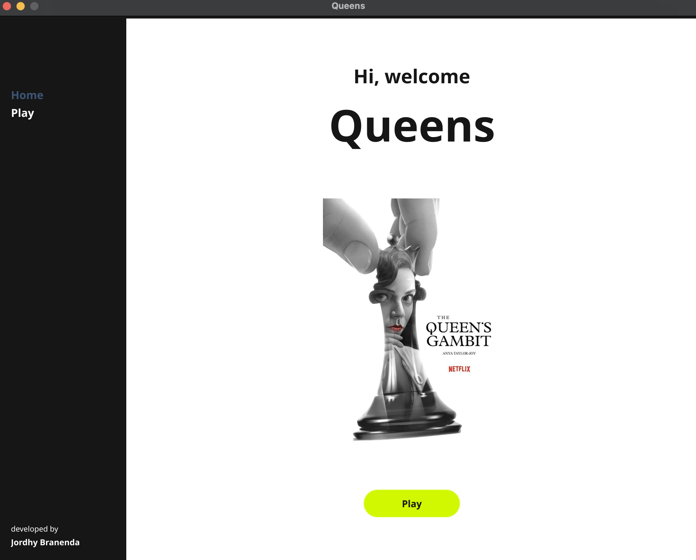

# Queens LinkedIn



Program solver untuk puzzle Queens menggunakan pure Brute Force Algorithm.
Queens adalah game logic yang tersedia pada situs jejaring profesional LinkedIn. Tujuan dari game ini adalah menempatkan queen pada sebuah board persegi berwarna sehingga terdapat exactly satu queen pada tiap baris, kolom, dan region warna.
Selain itu, satu queen tidak dapat ditempatkan bersebelahan dengan queen lainnya, termasuk secara diagonal.

## Requirements
- Go 1.16 or higher
- Fyne toolkit buat GUI

## How to Install
```bash
# Clone repo
git clone https://github.com/ethj0r/Tucil1_13524026.git
cd Tucil1_13524026

# Download dependencies
go mod tidy
```

## How to Build
```bash
go build -o bin/queens src/main.go
```

## How to Run

### GUI Mode (Default)
```bash
./bin/queens
```
Or langsung tanpa building:
```bash
go run src/main.go
```

**Catatan untuk GUI:**
- Input file test cases berada di folder `test/new` dan `test/old` (contoh: `case2.txt`, `case4.txt`)
- Saat menyimpan output, gunakan format `.png` untuk nama file (contoh: `solution.png`, `case2_output.png`)
- Output gambar akan berupa gambar board dengan visualisasi lengkap queen placement

### CLI Mode
```bash
./bin/queens --cli
```

## Format Inpt
File .txt dengan format:
- Each row represents a row on the board
- Each row contains characters representing color regions (A-Z)
- Board must be square (NxN)
- Each color region must be contiguous
- Each color region must contain exactly one queen in the solution
- No two queens can be adjacent, including diagonally
- The number of unique regions must equal the board size

Contoh (9x9):
```
AAABBCCCD
ABBBBCECD
ABBBDCECD
AAABDCCCD
BBBBDDDDD
FGGGDDHDD
FGIGDDHDD
FGIGDDHDD
FGGGDDHHH
```

## Author
**Made Branenda Jordhy**
13524026 - Teknik Informatika '24 - ITB
